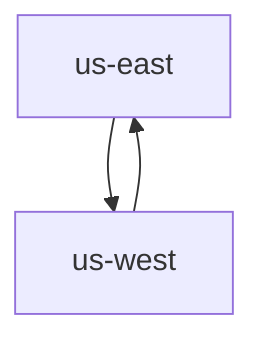

# PulsarGeoReplication

## Overview

PulsarGeoReplication is a custom resource that enables the configuration of geo-replication between different Pulsar instances. It allows you to set up unidirectional replication of data from one Pulsar cluster to another, even when these clusters are geographically distributed or in separate Pulsar instances.

Key points about PulsarGeoReplication:

1. It's used for configuring replication between separate Pulsar instances.
2. The replication is unidirectional. To set up bidirectional replication, you need to create two PulsarGeoReplication resources, one for each direction.
3. It creates a new cluster in the destination Pulsar instance for each PulsarGeoReplication resource.
4. It's different from configuring geo-replication between clusters within a single Pulsar instance. For that purpose, use the `replicationClusters` field in the `PulsarNamespace` resource instead.

PulsarGeoReplication is particularly useful for scenarios where you need to replicate data across different Pulsar deployments, such as disaster recovery, data locality, or compliance with data residency requirements.

## Warning

This resource should be used specifically for configuring geo-replication between clusters in different Pulsar instances. If you're looking to set up geo-replication between clusters within the same Pulsar instance, you should use the `replicationClusters` field in the `PulsarNamespace` resource instead.

Using PulsarGeoReplication for clusters within the same Pulsar instance may lead to unexpected behavior and is not the intended use case for this resource. Always ensure you're dealing with separate Pulsar instances before utilizing PulsarGeoReplication.

## Specifications

The `PulsarGeoReplication` resource has the following specifications:

| Field | Description | Required |
|-------|-------------|----------|
| `connectionRef` | Reference to the PulsarConnection resource used to connect to the source Pulsar cluster. | Yes |
| `destinationConnectionRef` | Reference to the PulsarConnection resource used to connect to the destination Pulsar cluster. | Yes |
| `lifecyclePolicy` | Determines whether to keep or delete the geo-replication configuration when the Kubernetes resource is deleted. Options: `CleanUpAfterDeletion`, `KeepAfterDeletion`. Default is `CleanUpAfterDeletion`. | No |

The `PulsarGeoReplication` resource is designed to configure geo-replication between separate Pulsar instances. It creates a new "Cluster" in the destination Pulsar cluster identified by `destinationConnectionRef`. This setup allows configuring the replication of data from the source cluster (identified by `connectionRef`) to the destination cluster. By establishing this connection, the brokers in the source cluster can communicate with and replicate data to the brokers in the destination cluster, enabling geo-replication between the two separate Pulsar instances.

### Deletion Behavior

The `lifecyclePolicy` field not only affects the geo-replication configuration but also determines how the Destination Cluster is handled in the source cluster when the PulsarGeoReplication resource is deleted:

- `CleanUpAfterDeletion` (default): When the PulsarGeoReplication resource is deleted, the operator will remove the Destination Cluster configuration from the source cluster. This means that the cluster entry created in the source cluster for the destination will be deleted using the Pulsar admin API's [DELETE /admin/v2/clusters/{cluster}](https://pulsar.apache.org/admin-rest-api/?apiversion=v2#operation/ClustersBase_deleteCluster) endpoint, effectively removing all traces of the geo-replication setup.

- `KeepAfterDeletion`: If this policy is set, the Destination Cluster configuration will remain in the source cluster even after the PulsarGeoReplication resource is deleted. This can be useful if you want to temporarily remove the Kubernetes resource while maintaining the ability to quickly re-establish the geo-replication later. The cluster configuration can be viewed using the Pulsar admin API's [GET /admin/v2/clusters/{cluster}](https://pulsar.apache.org/admin-rest-api/?apiversion=v2#operation/ClustersBase_getCluster) endpoint.

It's important to note that this deletion behavior applies to the cluster configuration in the source Pulsar instance. The actual destination Pulsar instance and its data are not affected by this deletion process. The operator only manages the configuration that enables communication between the two Pulsar instances for geo-replication purposes, which is set up using the Pulsar admin API's [PUT /admin/v2/clusters/{cluster}](https://pulsar.apache.org/admin-rest-api/?apiversion=v2#operation/ClustersBase_updateCluster) endpoint when the PulsarGeoReplication resource is created.

### Connection References

Both `connectionRef` and `destinationConnectionRef` are of type `corev1.LocalObjectReference`, which means they should reference existing PulsarConnection resources in the same namespace. For detailed information on how to create and manage PulsarConnection resources, please refer to the [PulsarConnection documentation](pulsar_connection.md).

Note: When configuring geo-replication between `connectionRef` and `destinationConnectionRef`, it is important to ensure:

1. The brokers in the `connectionRef` cluster are able to communicate with the `destinationConnectionRef` cluster, and the `destinationConnectionRef` cluster is able to authenticate the connections from the `connectionRef` cluster.

### Lifecycle Policy

The `lifecyclePolicy` field determines what happens to the geo-replication configuration when the Kubernetes PulsarGeoReplication resource is deleted:

- `CleanUpAfterDeletion` (default): The geo-replication configuration will be removed from both Pulsar clusters when the Kubernetes resource is deleted.
- `KeepAfterDeletion`: The geo-replication configuration will remain in both Pulsar clusters even after the Kubernetes resource is deleted.

For more information about lifecycle policies, refer to the [PulsarResourceLifeCyclePolicy documentation](pulsar_resource_lifecycle.md).

For more detailed information about geo-replication in Pulsar, refer to the [Pulsar Geo-replication documentation](https://pulsar.apache.org/docs/administration-geo/).

## Create PulsarGeoReplication

The PulsarGeoReplication is a unidirectional setup. When you create a PulsarGeoReplication for `us-east` only, data will be replicated from `us-east` to `us-west`. If you need to replicate data between clusters `us-east` and `us-west`, you need to create PulsarGeoReplication for both `us-east` and `us-west`.

The Pulsar Resource Operator will create a new cluster in the source connection for each PulsarGeoReplication. This new cluster represents the destination cluster and is created using the information from the PulsarConnection resource referenced by `destinationConnectionRef`. The name of this cluster will be derived from the destination cluster's name, which is specified in the `clusterName` field of the destination PulsarConnection. This setup allows the source cluster to recognize and replicate data to the destination cluster, enabling geo-replication between the two separate Pulsar instances.

1. Define a Geo-replication named `us-east-geo` and save the YAML file as `us-east-geo.yaml`. 

```yaml
apiVersion: resource.streamnative.io/v1alpha1
kind: PulsarGeoReplication
metadata:
  name: us-east-geo
  namespace: us-east
spec:
  connectionRef:
    name: us-east-cluster-local-connection
  destinationConnectionRef:
    name: us-east-cluster-destination-connection
  lifecyclePolicy: CleanUpAfterDeletion
```

2. Create the PulsarGeoReplication resource.

```bash
kubectl apply -f us-east-geo.yaml
```

3. Verify that the PulsarGeoReplication resource is created successfully.

```bash
kubectl get pulsargeoreplication us-east-geo -n us-east
``` 

4. Verify that the new cluster is created in the source Pulsar instance.

```bash
pulsar-admin clusters list --url http://<us-east-public-address>:8080
```

## Tutorial: How to configure Geo-replication

This section describes how to configure Geo-replication between clusters `us-east-sn-platform` and `us-west-sn-platform` in different namespaces of the same Kubernetes cluster.

The relation is shown below.


### Prerequisites

1. Deploy two separate pulsar clusters, each in a different namespace. Each cluster has its own configuration store.
2. Ensure that both clusters can access each other.

### Create a source PulsarConnection for `us-east`

Add the Pulsar cluster `us-east-sn-platform` information through the `clusterName` and `brokerServiceURL` fields to the existing PulsarConnection.

```yaml
apiVersion: resource.streamnative.io/v1alpha1
kind: PulsarConnection
metadata:
  name: us-east-local-connection
  namespace: us-east
spec:
  # The local us-east cluster name
  clusterName: us-east-sn-platform
  # The local us-east cluster connection URL, you can use Kubernetes internal DNS.  
  adminServiceURL: http://us-east-sn-platform-broker.us-east.svc.cluster.local:8080
  brokerServiceURL: pulsar://us-east-sn-platform-broker.us-east.svc.cluster.local:6650
```

### Create a destination PulsarConnection for `us-west`

The destination PulsarConnection has the information of the Pulsar cluster`us-west-sn-platform`. Add the Pulsar cluster `us-west-sn-platform` information through the `clusterName` and `brokerServiceURL` fields to the destination PulsarConnection.

```yaml
apiVersion: resource.streamnative.io/v1alpha1
kind: PulsarConnection
metadata:
  name: us-west-dest-connection
  namespace: us-west
spec:
  # The destination us-west cluster name
  clusterName: us-west-sn-platform
  # The destination us-west cluster connection URL, you should use Kubernetes external LB address.
  adminServiceURL: http://<us-west-public-address>:8080
  brokerServiceURL: pulsar://<us-west-public-address>:6650
```

#### Use tls connection

When you want to use tls to connect remote cluster, you need to do some extra steps.

1. For a selfsigning cert, you need to create a secret to store the cert file of connecting the `us-west` brokers.

```yaml
apiVersion: v1
data:
  ca.crt: xxxxx
kind: Secret
metadata:
  name: us-west-tls-broker
  namespace: us-esat
type: Opaque
```

2. Mount the secret to `us-west` pulsarbroker by adding these line to the `pulsarbroker.spec.pod.secretRefs`. The mount path will be used in `us-west` pulsar connection.
```yaml
spec:
  pod:
    secretRefs:
    - mountPath: /etc/tls/us-west
      secretName: us-west-tls-broker
```

3. Add `adminServiceSecureURL` and `brokerServiceSecureURL`  to the destination connection
```yaml
apiVersion: resource.streamnative.io/v1alpha1
kind: PulsarConnection
metadata:
  name: us-east-to-west-connection
  namespace: us-east
spec:
  # The destination us-west cluster name
  clusterName: us-west-sn-platform
  # The destination us-west cluster connection URL, you should use Kubernetes external LB address.
  adminServiceURL: http://<us-west-public-address>:8080
  brokerServiceURL: pulsar://<us-west-public-address>:6650
  authentication:
    token:
      value: xxxx
  adminServiceSecureURL: https://<us-west-public-address:8443 # the remote pulsar admin secure service
  brokerServiceSecureURL: pulsar+ssl://<us-west-public-address:6651 # the remote pulsar broker secure service
  brokerClientTrustCertsFilePath: /etc/tls/us-west/ca.crt # Optional. The cert path is the mountPath in the above step if you are using selfsigning cert. 
```

### Create a PulsarGeoReplication

This section enabled Geo-replication on `us-east`, which replicates data from `us-east` to `us-west`. The operator will create a new cluster entry called `us-west-sn-platform` in `us-east` cluster.

```yaml
apiVersion: resource.streamnative.io/v1alpha1
kind: PulsarGeoReplication
metadata:
  name: us-east-to-west-geo-replication
  namespace: us-east
spec:
  # The local us-east cluster connection
  connectionRef:
    name: us-east-local-connection
  # The destination us-west cluster connection
  destinationConnectionRef:
    name: us-east-to-west-connection
  lifecyclePolicy: CleanUpAfterDeletion
```

### Grant the permission for the tenant

You can create a new tenant or update an existing tenant by adding the field `geoReplicationRefs`. It will add the cluster `us-west-sn-platform` to the tenant.

```yaml
apiVersion: resource.streamnative.io/v1alpha1
kind: PulsarTenant
metadata:
  name: geo-tenant
  namespace: us-east
spec:
  name: geo-tenant
  connectionRef:
    name: us-east-local-connection
  geoReplicationRefs:
  - name: us-east-to-west-geo-replication
  lifecyclePolicy: CleanUpAfterDeletion
```

### Enable Geo-replication at the namespace level

You can create a new namespace or update an existing namespace by adding the field `geoReplicationRefs`. It will add the namespace to `us-west-sn-platform`.

> **Note**
>
> Once you enable Geo-replication at the namespace level, messages to all topics within that namespace are replicated across clusters.

```yaml
apiVersion: resource.streamnative.io/v1alpha1
kind: PulsarNamespace
metadata:
  name: geo-namespace
  namespace: us-east
spec:
  name: geo-test/geo-namespace
  connectionRef:
    name: us-east-local-connection
  geoReplicationRefs:
  - name: us-east-to-west-geo-replication
  lifecyclePolicy: CleanUpAfterDeletion
```

### Enable Geo-replication at the topic level

You can create a new topic or update an existing topic by adding the field `geoReplicationRefs`. It will add the topic to `us-west-sn-platform`.

```yaml
apiVersion: resource.streamnative.io/v1alpha1
kind: PulsarTopic
metadata:
  name: geo-topic
  namespace: us-east
spec:
  name: persistent://geo-test/geo-namespace/geo-topic
  partitions: 1
  connectionRef:
    name: us-east-local-connection
  geoReplicationRefs:
  - name: us-east-to-west-geo-replication
  lifecyclePolicy: CleanUpAfterDeletion
```

#### Test

After the resources are ready, you can test Geo-replication by producing and consuming messages.
- Open a terminal and run the command `./bin/pulsar-client produce geo-test/geo-namespace/geo-topic -m "hello" -n 10` to produce messages to `us-east`.
- Open another terminal and run the command `./bin/pulsar-client consume geo-test/geo-namespace/geo-topic -s sub -n 0` to consume messages from `us-west`.