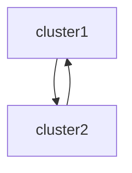

# PulsarGeoReplication

## Create PulsarGeoReplication

The PulsarGeoReplication is a one-way setup, you create a PulsarGeoReplication for `cluster1`, it will only setup for `cluster1->cluster2`. if you want to replicate data among `cluster1` and `cluster2`, you need to create another PulsarGeoReplication for `cluster2->cluster1`


The operator will create a new `cluster` named with the `clusterName` in the destination connection for each PulsarGeoReplication.


1. Define a geo replication named `cluster1-geo` by using the YAML file and save the YAML file `cluster1-geo.yaml`. 

```yaml
apiVersion: resource.streamnative.io/v1alpha1
kind: PulsarGeoReplication
metadata:
  name: cluster1-geo
  namespace: cluster1
spec:
  connectionRef:
    name: cluster1-connection
  destinationConnectionRef:
    name: cluster1-dest-connection
  lifecyclePolicy: CleanUpAfterDeletion
```

This table lists specifications available for the `PulsarTopic` resource.

| Option | Description | Required or not |
| ---| --- |--- |
| `connectionRef` | The reference to a PulsarConnection. | Yes |
| `destinationConnectionRef` | The reference to a destination PulsarConnection. | Yes |
| `lifecyclePolicy` | The resource lifecycle policy, CleanUpAfterDeletion or KeepAfterDeletion, the default is KeepAfterDeletion | Optional |


## How to setup a Geo Replication

This is a demo shows how to setup a geo replication.

The demo will set up geo-replication between cluster1, and cluster2, the relations are shown in the diagram.


The demo will use two pulsar clusters in the different namespaces in the same k8s cluster.
The cluster names are `cluster1-sn-platform` and `cluster2-sn-platform`.


### Prerequisites
1. You have two pulsar clusters at least.
2. Make sure both clusters can access each other.

### Update the existing PulsarConnection
You need to add the extra fields `clusterName` and `brokerServiceURL` for the existing PulsarConnection.

```yaml
apiVersion: resource.streamnative.io/v1alpha1
kind: PulsarConnection
metadata:
  name: cluster1-connection
  namespace: cluster1
spec:
  clusterName: cluster1-sn-platform # the local cluster name
  adminServiceURL: http://cluster1-sn-platform-broker.cluster1.svc.cluster.local:8080
  brokerServiceURL: http://cluster1-sn-platform-broker.cluster1.svc.cluster.local:6650
  authentication:
    token:
      secretRef:
        name: cluster1-sn-platform-vault-secret-env-injection
        key: brokerClientAuthenticationParameters
```

### Create a Destination PulsarConnection
First, you need to create a destination PulsarConnection, this connection indicates the info of the remote pulsar cluster.
You need to add two extra fields `clusterName` and `brokerServiceURL` for this PulsarConnection.

Notice, the token of the authentication only support using `value` now.

```yaml
apiVersion: resource.streamnative.io/v1alpha1
kind: PulsarConnection
metadata:
  name: cluster1-dest-connection
  namespace: cluster1
spec:
  clusterName: cluster2-sn-platform # the remote cluster name
  adminServiceURL: http://cluster2-sn-platform-broker.cluster2.svc.cluster.local:8080 # the remote pulsar admin service
  brokerServiceURL: pulsar://cluster2-sn-platform-broker.cluster2.svc.cluster.local:6650 # the remote pulsar broker service
  authentication:
    token:
      value: YzBkMzVjOGEtNWRiNi0yZGM3LTI4NjktZTM1NGU1YmJiNTY4OjAwZTk2MzgzLWFjY2YtMGMzOC1kNmRlLTY1ODc0ODkxNmE1ZQo=

```


### Create a PulsarGeoReplication
It means setup the geo replication from the `cluster1` to `cluster2`. The operator will create a new cluster called `cluster2-sn-platform`.

```yaml
apiVersion: resource.streamnative.io/v1alpha1
kind: PulsarGeoReplication
metadata:
  name: cluster1-geo
  namespace: cluster1
spec:
  connectionRef:
    name: cluster1-connection
  destinationConnectionRef:
    name: cluster1-dest-connection
  lifecyclePolicy: CleanUpAfterDeletion
```

### Grant the permission for the tenant

You can create a new tenant or update the existing the tenant with the field `geoReplicationRefs`. It will assign the `cluster2-sn-platform` to the tenant.

```yaml
apiVersion: resource.streamnative.io/v1alpha1
kind: PulsarTenant
metadata:
  name: cluster1-geo-tenant
  namespace: cluster1
spec:
  name: geo-test
  connectionRef:
    name: cluster1-connection
  geoReplicationRefs:
  - name: cluster1-geo
  lifecyclePolicy: CleanUpAfterDeletion
```

### Enable the geo replication at namespace level

You can create a new namespace or update the existing the namespace with the field `geoReplicationRefs`. It will assign the namespace to `cluster2-sn-platform`.

Notice, once you create a geo-replication namespace, any topics that producers or consumers create within that namespace are replicated across clusters

```yaml
apiVersion: resource.streamnative.io/v1alpha1
kind: PulsarNamespace
metadata:
  name: cluster1-geo-namespace
  namespace: cluster1
spec:
  name: geo-test/testn1
  geoReplicationRefs:
  - name: cluster1-geo
  connectionRef:
    name: cluster1-connection
  backlogQuotaLimitSize: 1Gi
  backlogQuotaLimitTime: 24h
  bundles: 16
  messageTTL: 1h
  lifecyclePolicy: CleanUpAfterDeletion

```


### Enable the geo replication at topic level

You can create a new topic or update the existing the topic with the field `geoReplicationRefs`. It will assign the topic to `cluster2-sn-platform`.

```yaml
apiVersion: resource.streamnative.io/v1alpha1
kind: PulsarTopic
metadata:
  name: cluster1-geo-topic1
  namespace: cluster1
spec:
  name: persistent://geo-test/testn1/topic1
  partitions: 1
  connectionRef:
    name: cluster1-connection
  geoReplicationRefs:
  - name: cluster1-geo
  lifecyclePolicy: CleanUpAfterDeletion
```

#### Test

After the resources are ready, you can test the geo-replication by producing and consuming messages.
- Run the command `./bin/pulsar-client produce geo-test/testn1/topic1 -m "hello" -n 10` in the cluster1.
- Run the command `./bin/pulsar-client consume geo-test/testn1/topic1 -s sub -n 0` in the cluster2.