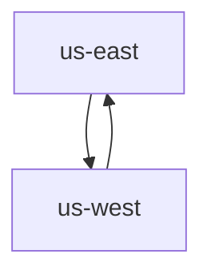

# PulsarGeoReplication

## Create PulsarGeoReplication

The PulsarGeoReplication is a unidirectional setup. When you create a PulsarGeoReplication for `us-east` only, data will be replicated from `us-east` to `us-west`. If you need to replicate data between clusters `us-east` and `us-west`, you need to create PulsarGeoReplication for both `us-east` and `us-west`.


The Pulsar Resource Operator will create a new cluster named `clusterName` in the destination connection for each PulsarGeoReplication.


1. Define a Geo-replication named `us-east-geo` and save the YAML file as `us-east-geo.yaml`. 

```yaml
apiVersion: resource.streamnative.io/v1alpha1
kind: PulsarGeoReplication
metadata:
  name: us-east-geo
  namespace: us-east
spec:
  connectionRef:
    name: us-east-connection
  destinationConnectionRef:
    name: us-east-dest-connection
  lifecyclePolicy: CleanUpAfterDeletion
```

This table lists specifications available for the `PulsarGeoReplication ` resource.

| Option | Description | Required or not |
| ---| --- |--- |
| `connectionRef` | The reference to a PulsarConnection. | Yes |
| `destinationConnectionRef` | The reference to a destination PulsarConnection. | Yes |
| `lifecyclePolicy` | The resource lifecycle policy. Available options are `CleanUpAfterDeletion` and `KeepAfterDeletion`. By default, it is set to `KeepAfterDeletion`. | Optional |


## How to configure Geo-replication

This section describes how to configure Geo-replication between clusters `us-east-sn-platform` and `us-west-sn-platform` in different namespaces of the same Kubernetes cluster.

The relation is shown below.


### Prerequisites
1. Deploy two pulsar clusters.
2. Ensure that both clusters can access each other.

### Update the existing PulsarConnection
Add the Pulsar cluster `us-east-sn-platform` information through the `clusterName` and `brokerServiceURL` fields to the existing PulsarConnection.

```yaml
apiVersion: resource.streamnative.io/v1alpha1
kind: PulsarConnection
metadata:
  name: us-east-connection
  namespace: us-east
spec:
  clusterName: us-east-sn-platform # the local cluster name
  adminServiceURL: http://us-east-sn-platform-broker.us-east.svc.cluster.local:8080
  brokerServiceURL: pulsar://us-east-sn-platform-broker.us-east.svc.cluster.local:6650
  authentication:
    token:
      secretRef:
        name: us-east-token-secret
        key: brokerClientAuthenticationParameters
```

### Create a destination PulsarConnection
The destination PulsarConnection has the information of the Pulsar cluster`us-west-sn-platform`.
Add the Pulsar cluster `us-west-sn-platform` information through the `clusterName` and `brokerServiceURL` fields to the destination PulsarConnection.

```yaml
apiVersion: resource.streamnative.io/v1alpha1
kind: PulsarConnection
metadata:
  name: us-east-dest-connection
  namespace: us-east
spec:
  clusterName: us-west-sn-platform # the remote cluster name
  adminServiceURL: http://<us-west-public-address>:8080 # the remote pulsar admin service
  brokerServiceURL: pulsar://<us-west-public-address>:6650 # the remote pulsar broker service
  authentication:
    token:
      secretRef:
        name: us-west-token-secret
        key: brokerClientAuthenticationParameters
```


### Create a PulsarGeoReplication
This section enabled Geo-replication on `us-east`, which replicates data from `us-east` to `us-west`. The operator will create a new cluster called `us-west-sn-platform`.

```yaml
apiVersion: resource.streamnative.io/v1alpha1
kind: PulsarGeoReplication
metadata:
  name: us-east-geo
  namespace: us-east
spec:
  connectionRef:
    name: us-east-connection
  destinationConnectionRef:
    name: us-east-dest-connection
  lifecyclePolicy: CleanUpAfterDeletion
```

### Grant the permission for the tenant

You can create a new tenant or update an existing tenant by adding the field `geoReplicationRefs`. It will add the cluster `us-west-sn-platform` to the tenant.

```yaml
apiVersion: resource.streamnative.io/v1alpha1
kind: PulsarTenant
metadata:
  name: us-east-geo-tenant
  namespace: us-east
spec:
  name: geo-test
  connectionRef:
    name: us-east-connection
  geoReplicationRefs:
  - name: us-east-geo
  lifecyclePolicy: CleanUpAfterDeletion
```

### Enable Geo-replication at the namespace level

You can create a new namespace or update an existing namespace by adding the field `geoReplicationRefs`. It will add the namespace to `us-west-sn-platform`.

> **Note**
>
> Once you enable Geo-replication at the namespace level, messages to all topics within that namespace are replicated across clusters.

```yaml
apiVersion: resource.streamnative.io/v1alpha1
kind: PulsarNamespace
metadata:
  name: us-east-geo-namespace
  namespace: us-east
spec:
  name: geo-test/testn1
  geoReplicationRefs:
  - name: us-east-geo
  connectionRef:
    name: us-east-connection
  backlogQuotaLimitSize: 1Gi
  backlogQuotaLimitTime: 24h
  bundles: 16
  messageTTL: 1h
  lifecyclePolicy: CleanUpAfterDeletion

```


### Enable Geo-replication at the topic level

You can create a new topic or update an existing topic by adding the field `geoReplicationRefs`. It will add the topic to `cluster2-sn-platform`.

```yaml
apiVersion: resource.streamnative.io/v1alpha1
kind: PulsarTopic
metadata:
  name: us-east-geo-topic1
  namespace: us-east
spec:
  name: persistent://geo-test/testn1/topic1
  partitions: 1
  connectionRef:
    name: us-east-connection
  geoReplicationRefs:
  - name: us-east-geo
  lifecyclePolicy: CleanUpAfterDeletion
```

#### Test

After the resources are ready, you can test Geo-replication by producing and consuming messages.
- Open a terminal and run the command `./bin/pulsar-client produce geo-test/testn1/topic1 -m "hello" -n 10` to produce messages to `us-east`.
- Open another terminal and run the command `./bin/pulsar-client consume geo-test/testn1/topic1 -s sub -n 0` to consume messages from `ue-west`.