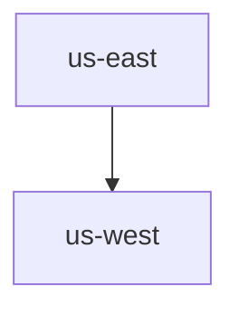

# PulsarGeoReplication

## Overview

PulsarGeoReplication is a custom resource that enables the configuration of geo-replication between different Pulsar instances. It allows you to set up unidirectional replication of data from one Pulsar cluster to another, even when these clusters are geographically distributed or in separate Pulsar instances.

Key points about PulsarGeoReplication:

1. It's used for configuring replication between separate Pulsar instances.
2. The replication is unidirectional. To set up bidirectional replication, you need to create two PulsarGeoReplication resources, one for each direction.
3. It creates or updates a cluster entry in the **source** Pulsar instance. That entry uses the destination connection's `clusterName` and service/authentication settings.
4. It's different from configuring geo-replication between clusters within a single Pulsar instance. For that purpose, use the `replicationClusters` field in the `PulsarNamespace` resource instead.

PulsarGeoReplication is particularly useful for scenarios where you need to replicate data across different Pulsar deployments, such as disaster recovery, data locality, or compliance with data residency requirements.

## Warning

This resource should be used specifically for configuring geo-replication between clusters in different Pulsar instances. If you're looking to set up geo-replication between clusters within the same Pulsar instance, you should use the `replicationClusters` field in the `PulsarNamespace` resource instead.

Using PulsarGeoReplication for clusters within the same Pulsar instance may lead to unexpected behavior and is not the intended use case for this resource. Always ensure you're dealing with separate Pulsar instances before utilizing PulsarGeoReplication.

## Specifications

The `PulsarGeoReplication` resource has the following specifications:

| Field | Description | Required |
|-------|-------------|----------|
| `connectionRef` | Reference to the PulsarConnection resource used to connect to the source Pulsar cluster. | Yes |
| `destinationConnectionRef` | Reference to the PulsarConnection resource used to connect to the destination Pulsar cluster. | Yes |
| `lifecyclePolicy` | Determines whether to keep or delete the geo-replication configuration when the Kubernetes resource is deleted. Options: `CleanUpAfterDeletion`, `KeepAfterDeletion`. Default is `CleanUpAfterDeletion`. | No |
| `clusterParamsOverride` | Allows overriding specific cluster parameters when setting up geo-replication. This is useful when the destination cluster requires different configuration than what's defined in the `destinationConnectionRef`. See [Cluster Parameters Override](#cluster-parameters-override) for details. | No |

The `PulsarGeoReplication` resource is designed to configure geo-replication between separate Pulsar instances. It creates a cluster entry in the source cluster identified by `connectionRef`, using connection data from `destinationConnectionRef`. Source brokers then use that entry to connect and replicate data to the destination cluster.

### Deletion Behavior

The `lifecyclePolicy` field not only affects the geo-replication configuration but also determines how the Destination Cluster is handled in the source cluster when the PulsarGeoReplication resource is deleted:

- `CleanUpAfterDeletion` (default): When the PulsarGeoReplication resource is deleted, the operator will remove the Destination Cluster configuration from the source cluster. This means that the cluster entry created in the source cluster for the destination will be deleted using the Pulsar admin API's [DELETE /admin/v2/clusters/{cluster}](https://pulsar.apache.org/admin-rest-api/?apiversion=v2#operation/ClustersBase_deleteCluster) endpoint, effectively removing all traces of the geo-replication setup.

- `KeepAfterDeletion`: If this policy is set, the Destination Cluster configuration will remain in the source cluster even after the PulsarGeoReplication resource is deleted. This can be useful if you want to temporarily remove the Kubernetes resource while maintaining the ability to quickly re-establish the geo-replication later. The cluster configuration can be viewed using the Pulsar admin API's [GET /admin/v2/clusters/{cluster}](https://pulsar.apache.org/admin-rest-api/?apiversion=v2#operation/ClustersBase_getCluster) endpoint.

It's important to note that this deletion behavior applies to the cluster configuration in the source Pulsar instance. The actual destination Pulsar instance and its data are not affected by this deletion process. The operator only manages the configuration that enables communication between the two Pulsar instances for geo-replication purposes, which is set up using the Pulsar admin API's [PUT /admin/v2/clusters/{cluster}](https://pulsar.apache.org/admin-rest-api/?apiversion=v2#operation/ClustersBase_updateCluster) endpoint when the PulsarGeoReplication resource is created.

### Connection References

Both `connectionRef` and `destinationConnectionRef` are of type `corev1.LocalObjectReference`, which means they should reference existing PulsarConnection resources in the same namespace. For detailed information on how to create and manage PulsarConnection resources, please refer to the [PulsarConnection documentation](pulsar_connection.md).

Note: When configuring geo-replication between `connectionRef` and `destinationConnectionRef`, it is important to ensure:

1. The brokers in the `connectionRef` cluster are able to communicate with the `destinationConnectionRef` cluster, and the `destinationConnectionRef` cluster is able to authenticate the connections from the `connectionRef` cluster.

### Cluster Parameters Override

The `clusterParamsOverride` field provides a powerful way to customize cluster configuration for geo-replication without modifying the underlying `PulsarConnection` resource. This is particularly useful when:

1. **Different authentication is required** for geo-replication compared to regular cluster operations
2. **Alternative URLs need to be used** for inter-cluster communication
3. **Specific TLS configurations** are needed for cross-cluster connections

#### Supported Override Parameters

The `clusterParamsOverride` supports the following fields:

- **URL Configuration**:
  - `serviceURL`: Override the HTTP(S) URL for the Pulsar cluster's admin service
  - `serviceSecureURL`: Override the HTTPS URL for secure admin connections
  - `brokerServiceURL`: Override the non-TLS URL for broker connections
  - `brokerServiceSecureURL`: Override the TLS-enabled URL for secure broker connections

- **TLS Configuration**:
  - `brokerClientTrustCertsFilePath`: Override the path to trusted TLS certificates

- **Authentication Configuration**:
  - `authentication.authPlugin`: Override the authentication plugin class name
  - `authentication.authParameters`: Override the authentication parameters

#### Authentication Override Benefits

When `authentication` is specified in the override, the system automatically:
- **Skips secret validation checks** for the destination connection
- **Avoids unnecessary Secret API calls** for improved performance
- **Uses the override authentication directly** without processing the destinationConnectionRef authentication

#### Example Usage

```yaml
apiVersion: resource.streamnative.io/v1alpha1
kind: PulsarGeoReplication
metadata:
  name: us-east-to-west-geo-replication
  namespace: us-east
spec:
  connectionRef:
    name: us-east-local-connection
  destinationConnectionRef:
    name: us-east-to-west-connection
  clusterParamsOverride:
    # Override URLs for cross-cluster communication
    serviceSecureURL: "https://geo-replication-admin.us-west.example.com:8443"
    brokerServiceSecureURL: "pulsar+ssl://geo-replication-broker.us-west.example.com:6651"
    # Override authentication for geo-replication
    authentication:
      authPlugin: "org.apache.pulsar.client.impl.auth.AuthenticationToken"
      authParameters: "token:geo-replication-specific-token"
```

**Important Notes**:
- Override parameters take precedence over the corresponding fields in `destinationConnectionRef`
- Only non-null override values will replace the destination connection values
- Authentication override is particularly useful for scenarios requiring different credentials for geo-replication
- The override does not affect how the operator connects to manage other resources in the destination cluster

### Lifecycle Policy

The `lifecyclePolicy` field determines what happens to the geo-replication configuration when the Kubernetes PulsarGeoReplication resource is deleted:

- `CleanUpAfterDeletion` (default): The destination cluster entry is removed from the source Pulsar cluster when the Kubernetes resource is deleted.
- `KeepAfterDeletion`: The destination cluster entry remains in the source Pulsar cluster after the Kubernetes resource is deleted.

Remove references from `PulsarTenant`, `PulsarNamespace`, and `PulsarTopic` resources before deleting a geo-replication resource. Pulsar can reject cluster deletion while replication policies still reference it.

For more information about lifecycle policies, refer to the [PulsarResourceLifeCyclePolicy documentation](pulsar_resource_lifecycle.md).

For more detailed information about geo-replication in Pulsar, refer to the [Pulsar Geo-replication documentation](https://pulsar.apache.org/docs/administration-geo/).

## Create PulsarGeoReplication

The PulsarGeoReplication is a unidirectional setup. When you create a PulsarGeoReplication for `us-east` only, data will be replicated from `us-east` to `us-west`. If you need to replicate data between clusters `us-east` and `us-west`, you need to create PulsarGeoReplication for both `us-east` and `us-west`.

The Pulsar Resource Operator will create a new cluster in the source connection for each PulsarGeoReplication. This new cluster represents the destination cluster and is created using the information from the PulsarConnection resource referenced by `destinationConnectionRef`. The name of this cluster will be derived from the destination cluster's name, which is specified in the `clusterName` field of the destination PulsarConnection. This setup allows the source cluster to recognize and replicate data to the destination cluster, enabling geo-replication between the two separate Pulsar instances.

1. Define a Geo-replication named `us-east-geo` and save the YAML file as `us-east-geo.yaml`. 

```yaml
apiVersion: resource.streamnative.io/v1alpha1
kind: PulsarGeoReplication
metadata:
  name: us-east-geo
  namespace: us-east
spec:
  connectionRef:
    name: us-east-cluster-local-connection
  destinationConnectionRef:
    name: us-east-cluster-destination-connection
  lifecyclePolicy: CleanUpAfterDeletion
```

2. Create the PulsarGeoReplication resource.

```bash
kubectl apply -f us-east-geo.yaml
```

3. Verify that the PulsarGeoReplication resource is created successfully.

```bash
kubectl get pulsargeoreplication us-east-geo -n us-east
``` 

4. Verify that the new cluster is created in the source Pulsar instance.

```bash
pulsar-admin clusters list --url http://<us-east-public-address>:8080
```

## Tutorial: How to configure Geo-replication

This section configures one-way replication from `us-east-sn-platform` to `us-west-sn-platform`, with the two Pulsar instances deployed in different Kubernetes namespaces. Repeat the setup in the opposite direction for bidirectional replication.

The relation is shown below.

```mermaid
graph TD;
  us-east-->us-west;
```

### Prerequisites

1. Deploy two separate pulsar clusters, each in a different namespace. Each cluster has its own configuration store.
2. Ensure that both clusters can access each other.

### Create a source PulsarConnection for `us-east`

Add the Pulsar cluster `us-east-sn-platform` information through the `clusterName` and `brokerServiceURL` fields to the existing PulsarConnection.

```yaml
apiVersion: resource.streamnative.io/v1alpha1
kind: PulsarConnection
metadata:
  name: us-east-local-connection
  namespace: us-east
spec:
  # The local us-east cluster name
  clusterName: us-east-sn-platform
  # The local us-east cluster connection URL, you can use Kubernetes internal DNS.  
  adminServiceURL: http://us-east-sn-platform-broker.us-east.svc.cluster.local:8080
  brokerServiceURL: pulsar://us-east-sn-platform-broker.us-east.svc.cluster.local:6650
```

### Create a destination PulsarConnection for `us-west`

The destination PulsarConnection has the information of the Pulsar cluster`us-west-sn-platform`. Add the Pulsar cluster `us-west-sn-platform` information through the `clusterName` and `brokerServiceURL` fields to the destination PulsarConnection.

```yaml
apiVersion: resource.streamnative.io/v1alpha1
kind: PulsarConnection
metadata:
  name: us-east-to-west-connection
  namespace: us-east
spec:
  # The destination us-west cluster name
  clusterName: us-west-sn-platform
  # The destination us-west cluster connection URL, you should use Kubernetes external LB address.
  adminServiceURL: http://<us-west-public-address>:8080
  brokerServiceURL: pulsar://<us-west-public-address>:6650
```

#### Use tls connection

When source brokers use TLS to connect to the remote cluster, the trust certificate path stored in cluster metadata must exist on those source brokers.

1. For a self-signed certificate, create a Secret containing the CA certificate in the source broker namespace.

```yaml
apiVersion: v1
data:
  ca.crt: xxxxx
kind: Secret
metadata:
  name: us-west-tls-broker
  namespace: us-east
type: Opaque
```

2. Mount the Secret into the **source** (`us-east`) brokers. The exact pod configuration depends on how Pulsar is deployed; the resulting mount path is referenced by `brokerClientTrustCertsFilePath`.
```yaml
spec:
  pod:
    secretRefs:
    - mountPath: /etc/tls/us-west
      secretName: us-west-tls-broker
```

3. If the remote admin endpoint also uses that self-signed CA, make the CA available inside the operator container and set `tlsTrustCertsFilePath`. Kubernetes Secret volumes are namespace-scoped, so create an equivalent Secret in the operator release namespace and mount it with the chart's `extraVolumes` and `extraVolumeMounts` values.

4. Add the secure URLs and trust paths to the destination connection.
```yaml
apiVersion: resource.streamnative.io/v1alpha1
kind: PulsarConnection
metadata:
  name: us-east-to-west-connection
  namespace: us-east
spec:
  # The destination us-west cluster name
  clusterName: us-west-sn-platform
  # The destination us-west cluster connection URL, you should use Kubernetes external LB address.
  adminServiceURL: http://<us-west-public-address>:8080
  brokerServiceURL: pulsar://<us-west-public-address>:6650
  authentication:
    token:
      value: xxxx
  adminServiceSecureURL: https://<us-west-public-address>:8443 # remote Pulsar admin TLS service
  brokerServiceSecureURL: pulsar+ssl://<us-west-public-address>:6651 # remote Pulsar broker TLS service
  tlsTrustCertsFilePath: /etc/operator-tls/us-west/ca.crt # path inside operator container
  brokerClientTrustCertsFilePath: /etc/tls/us-west/ca.crt # path mounted on source brokers
```

### Create a PulsarGeoReplication

This section enables geo-replication on `us-east`, which replicates data from `us-east` to `us-west`. The operator creates a cluster entry named `us-west-sn-platform` in the `us-east` cluster.

```yaml
apiVersion: resource.streamnative.io/v1alpha1
kind: PulsarGeoReplication
metadata:
  name: us-east-to-west-geo-replication
  namespace: us-east
spec:
  # The local us-east cluster connection
  connectionRef:
    name: us-east-local-connection
  # The destination us-west cluster connection
  destinationConnectionRef:
    name: us-east-to-west-connection
  lifecyclePolicy: CleanUpAfterDeletion
```

### Grant the permission for the tenant

You can create a new tenant or update an existing tenant by adding the field `geoReplicationRefs`. It will add the cluster `us-west-sn-platform` to the tenant.

```yaml
apiVersion: resource.streamnative.io/v1alpha1
kind: PulsarTenant
metadata:
  name: geo-tenant
  namespace: us-east
spec:
  name: geo-tenant
  connectionRef:
    name: us-east-local-connection
  geoReplicationRefs:
  - name: us-east-to-west-geo-replication
  lifecyclePolicy: CleanUpAfterDeletion
```

### Enable Geo-replication at the namespace level

You can create a new namespace or update an existing namespace by adding the field `geoReplicationRefs`. It will add the namespace to `us-west-sn-platform`.

> **Note**
>
> Once you enable Geo-replication at the namespace level, messages to all topics within that namespace are replicated across clusters.

```yaml
apiVersion: resource.streamnative.io/v1alpha1
kind: PulsarNamespace
metadata:
  name: geo-namespace
  namespace: us-east
spec:
  name: geo-test/geo-namespace
  connectionRef:
    name: us-east-local-connection
  geoReplicationRefs:
  - name: us-east-to-west-geo-replication
  lifecyclePolicy: CleanUpAfterDeletion
```

### Enable Geo-replication at the topic level

You can create a new topic or update an existing topic by adding the field `geoReplicationRefs`. It will add the topic to `us-west-sn-platform`.

```yaml
apiVersion: resource.streamnative.io/v1alpha1
kind: PulsarTopic
metadata:
  name: geo-topic
  namespace: us-east
spec:
  name: persistent://geo-test/geo-namespace/geo-topic
  partitions: 1
  connectionRef:
    name: us-east-local-connection
  geoReplicationRefs:
  - name: us-east-to-west-geo-replication
  lifecyclePolicy: CleanUpAfterDeletion
```

#### Test

After the resources are ready, you can test Geo-replication by producing and consuming messages.
- Open a terminal and run the command `./bin/pulsar-client produce geo-test/geo-namespace/geo-topic -m "hello" -n 10` to produce messages to `us-east`.
- Open another terminal and run the command `./bin/pulsar-client consume geo-test/geo-namespace/geo-topic -s sub -n 0` to consume messages from `us-west`.
